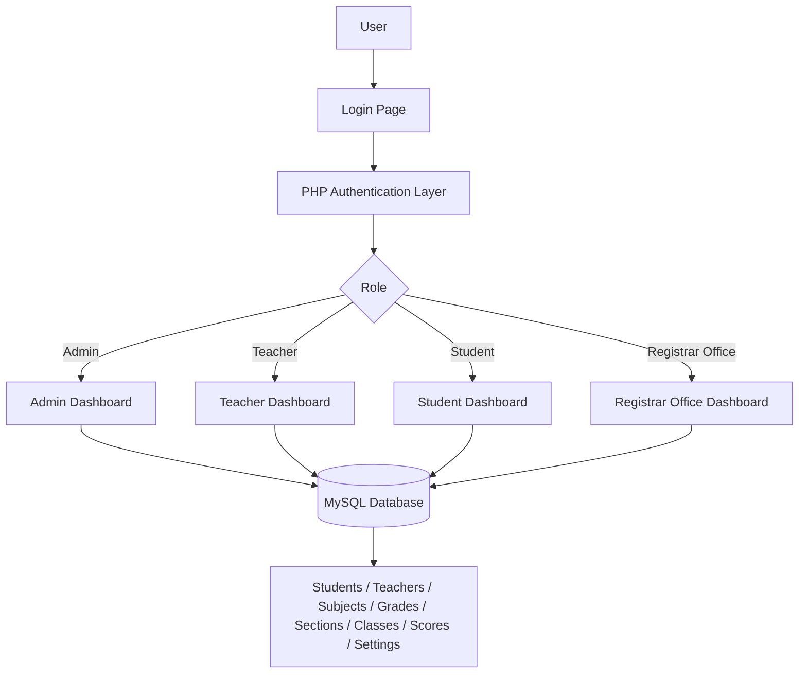

# School Management System

A PHP-based school management system for managing staff, students, classes, grades, subjects, and academic records through role-based dashboards.

   

## Project Overview

This project is a server-rendered web application built in PHP for a school environment. It provides different user roles for administrators, teachers, students, and registrar office staff, each with a dedicated dashboard and access flow. The application is designed to manage the essential operations of a school system: creating and updating student and teacher records, organizing grades and sections, assigning subjects, and tracking academic scores.

The core problem it solves is the lack of a simple internal system to manage academic records and user access in a single place. The project implements this through direct interaction with a MySQL database, session-based login, and role-specific views. The data model includes students, teachers, classes, sections, grades, subjects, settings, and score records, making it suitable for a small to medium-sized school administration workflow.

This project is structured as a traditional PHP application with separate role-based pages rather than a modern framework architecture. That makes it straightforward to understand and extend while still covering the main school management needs: enrollment, academic classification, assignments, score management, and administrative configuration.

## My Role

In this codebase, I was responsible for the end-to-end implementation of the application as a complete PHP-based management system. My contribution included:

- Designing and implementing the role-based authentication flow
- Building the admin dashboard and management screens for users, classes, sections, grades, and subjects
- Developing the registrar office and student management workflows
- Implementing teacher access for viewing assigned classes and recording student results
- Creating the database schema and data access logic for MySQL
- Handling session-based access control and password verification
- Structuring the application into separate frontend modules and request handlers for each role

## Key Features

### User Features

- Role-based login for:
  - Admin
  - Teacher
  - Student
  - Registrar Office
- Session-based access control with redirects for unauthorized access
- Password verification using PHP’s password hashing mechanism
- Simple home page and contact form

### Admin Features

- Manage teachers
- Manage students
- Manage registrar office users
- Manage classes
- Manage sections
- Manage grades
- Manage subjects/courses
- View and manage incoming contact messages
- Update school settings such as name, slogan, year, and semester

### Teacher Features

- View teacher profile and assigned class information
- View student records for class sections
- Update student scores by subject, year, and semester
- Manage score records for academic evaluation

### Student Features

- View student profile
- View grade and section information
- View academic-related information associated with the account

### Registrar Office Features

- Register new students
- View student records
- Manage student list as part of administrative enrollment support

### Backend Features

- PDO-based database connection
- Prepared SQL statements for data access
- Server-side validation for required login fields and user actions
- Structured, multi-page PHP application with role-specific authorization checks

---

## Technology Stack

| Category | Technologies |
|---|---|
| Frontend | HTML, CSS, Bootstrap 5, JavaScript, jQuery |
| Backend | PHP |
| Database | MySQL / MariaDB |
| Data Access | PDO |
| Authentication | Session-based login with password verification |
| Styling | Custom CSS and Bootstrap components |
| Server | Apache-compatible PHP web server / local PHP development server |

---

## System Architecture



---

## Application Workflow

1. A user opens the home page or login page.
2. They select a role such as Admin, Teacher, Student, or Registrar Office.
3. The login request is submitted to the PHP backend.
4. The backend validates the username, password, and selected role.
5. If the credentials match, the system stores the user identity in PHP sessions.
6. The user is redirected to the appropriate dashboard.
7. The dashboard loads role-specific data from the MySQL database.
8. The user can add, edit, delete, view, or update academic and administrative records.
9. On logout, the session is cleared and the user is returned to the login flow.

---

## Project Structure

```text
school/
├── admin/
│   ├── data/
│   ├── inc/
│   ├── req/
│   ├── *.php
│   └── index.php
├── Teacher/
│   ├── data/
│   ├── inc/
│   ├── req/
│   ├── *.php
│   └── index.php
├── Student/
│   ├── data/
│   ├── inc/
│   ├── req/
│   ├── *.php
│   └── index.php
├── RegistrarOffice/
│   ├── data/
│   ├── req/
│   ├── *.php
│   └── index.php
├── css/
│   └── style.css
├── data/
│   └── setting.php
├── req/
│   ├── login.php
│   ├── contact.php
│   └── ...
├── DB_connection.php
├── index.php
├── login.php
├── logout.php
├── sms_db.sql
├── logo.png
└── img/
```

### Important Directories

- `admin/`: contains the administrative dashboard and CRUD modules for managing students, teachers, classes, sections, grades, courses, and system settings.
- `Teacher/`: contains teacher-specific profile, score management, and class/student views.
- `Student/`: contains student dashboard and profile-related pages.
- `RegistrarOffice/`: contains registrar workflows focused on student registration.
- `req/`: contains backend request handlers for form submissions and login processing.
- `data/`: contains project data retrieval functions for entities such as settings, sections, grades, and students.
- `css/`: contains the application styles.

---

## Installation & Setup

1. Clone the repository:
```bash
git clone <repository-url>
cd school
```

2. Ensure PHP and MySQL are installed locally.

3. Create a database named `sms_db` in MySQL.

4. Import the database schema from `sms_db.sql`:
```bash
mysql -u root -p sms_db < sms_db.sql
```

5. Update the connection settings in `DB_connection.php` if your local MySQL credentials differ:
```php
$sName = "localhost";
$uName = "root";
$pass  = "";
$db_name = "sms_db";
```

6. Start a local PHP server from the project root:
```bash
php -S localhost:8000
```

7. Open the application in the browser:
```text
http://localhost:8000/login.php
```

> The project uses a direct database connection in `DB_connection.php` and does not include a framework-based environment configuration system.

---

## Environment Variables

This project does not use a `.env` file or environment-variable-based configuration. The database connection details are currently defined directly in `DB_connection.php`.

Recommended practice for a production environment:

- Move database credentials to a secure environment configuration
- Never commit private credentials to GitHub
- Keep local development credentials separate from production values

---

## Database

This project uses MySQL/MariaDB with the schema defined in `sms_db.sql`.

### Major Entities

- `admin`
- `teachers`
- `students`
- `registrar_office`
- `class`
- `section`
- `grades`
- `subjects`
- `student_score`
- `setting`
- `message`

### Key Relationships

- `students` are linked to a `grade` and `section`
- `class` contains grade and section assignments
- `teachers` store class and subject metadata
- `student_score` records academic results by `student_id`, `teacher_id`, `subject_id`, `year`, and `semester`
- `setting` stores school configuration data such as name, slogan, year, and semester


---

## Security

The project includes the following security-related mechanisms that are actually present in the code:

- Password hashing and verification using PHP `password_hash()` and `password_verify()`
- Session-based authentication using `$_SESSION`
- Role-based access checks before loading dashboard pages
- Prepared statements using PDO for database queries
- Input validation for required login fields

The codebase does not show evidence of:

- JWT token authentication
- CSRF protection
- OAuth or SSO
- Environment-variable-based secret management
- Multi-factor authentication

---

## Challenges & Engineering Decisions

### Role-Based Access Control

The application uses role-based access to separate admin, teacher, student, and registrar workflows. Each role is validated through session checks before access is granted to dashboard pages, which keeps user access isolated.

### Data Modeling for School Operations

The project models academic operations through normalized tables like `students`, `teachers`, `subjects`, `grades`, `section`, and `student_score`. This allows the app to represent school structure and assessments in a consistent database-driven workflow.

### CRUD-Driven Administration

The admin and registrar areas contain multiple create, read, update, and delete flows across different entities. These are implemented as PHP pages and request handlers, which allowed a compact but functional school administration system to be built without a framework.

### Academic Score Tracking

The `student_score` table stores semester and year-based results, making it possible to track performance over time and associate marks with the student, teacher, and subject involved.

---

## What I Learned

This project strengthened practical skills in:

- PHP application development
- MySQL database design and queries
- Session-based authentication and authorization
- CRUD workflow design
- Role-based access control
- Building multi-page web applications without a framework
- Integrating business logic with user interfaces
- Handling server-side validation and user flows

---

## Project Status

Completed

---

## Repository Notice

This repository contains the project source code for educational and portfolio purposes.

---

## Author

**Chaudhry Mubashir Naseer**

**Software Engineer**

**Backend & Full-Stack Development | Linux & Cloud Infrastructure | AWS | OLVM/KVM**
